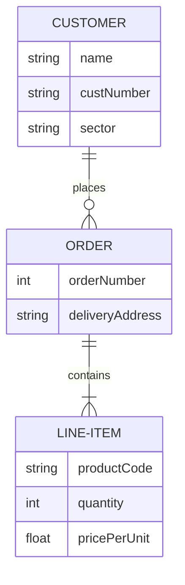
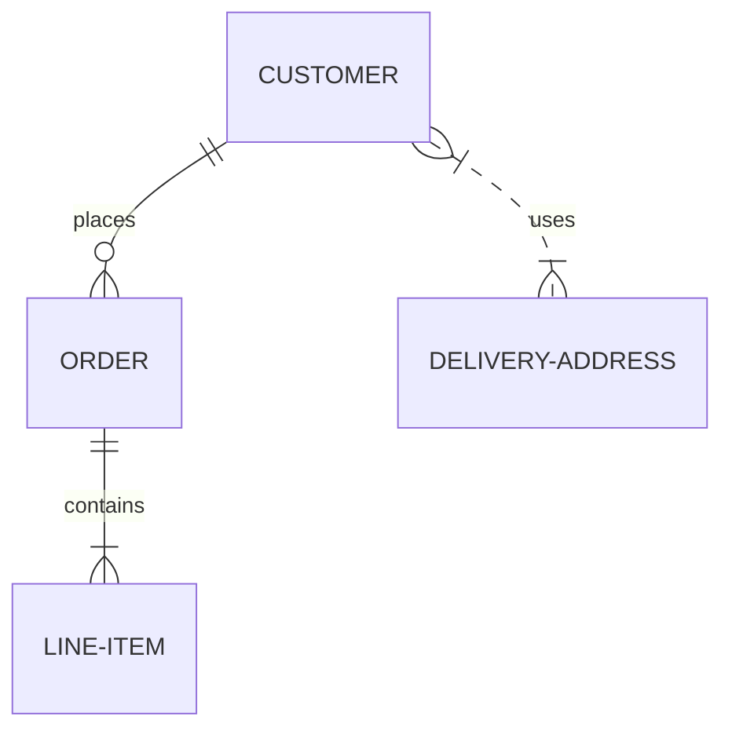
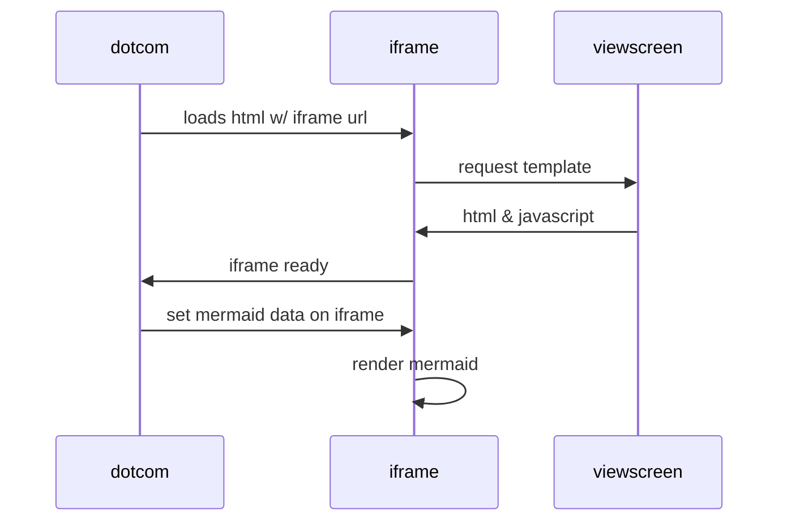
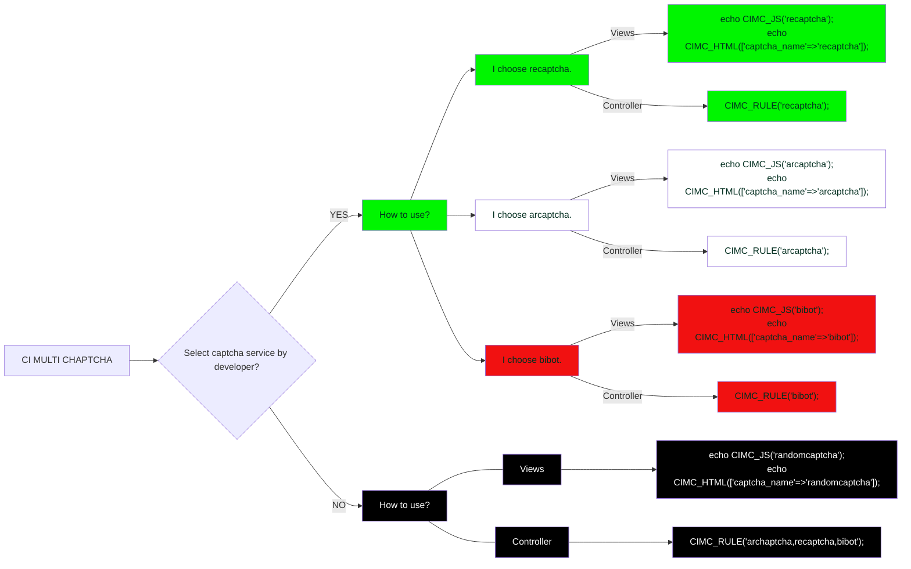
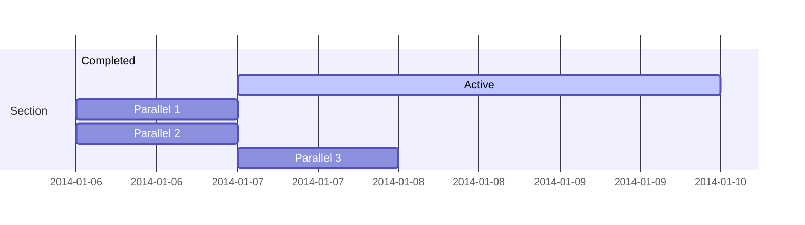
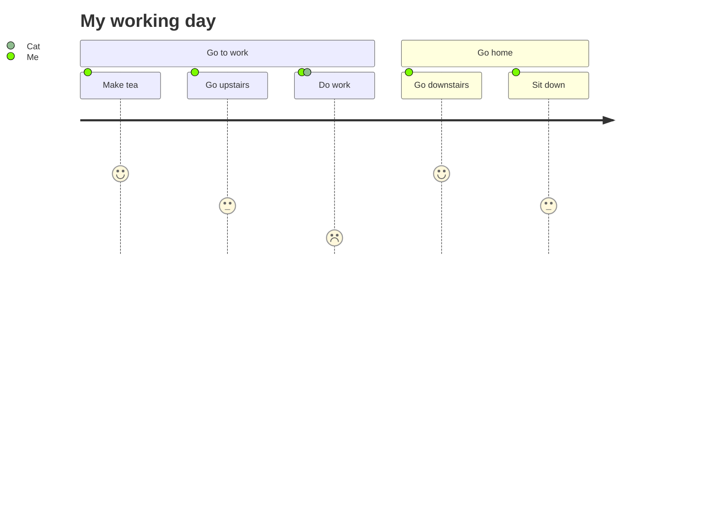

# test-mermaid7

```mermaid
erDiagram
    CUSTOMER ||--o{ ORDER : places
    CUSTOMER {
        string name
        string custNumber
        string sector
    }
    ORDER ||--|{ LINE-ITEM : contains
    ORDER {
        int orderNumber
        string deliveryAddress
    }
    LINE-ITEM {
        string productCode
        int quantity
        float pricePerUnit
    }
```

```mermaid
erDiagram
    CUSTOMER ||--o{ ORDER : places
    ORDER ||--|{ LINE-ITEM : contains
    CUSTOMER }|..|{ DELIVERY-ADDRESS : uses
```

```mermaid
  graph TD;
      A-->B;
      A-->C;
      B-->D;
      C-->D;
```

```mermaid
sequenceDiagram
    participant dotcom
    participant iframe
    participant viewscreen
    dotcom->>iframe: loads html w/ iframe url
    iframe->>viewscreen: request template
    viewscreen->>iframe: html & javascript
    iframe->>dotcom: iframe ready
    dotcom->>iframe: set mermaid data on iframe
    iframe->>iframe: render mermaid
```

```mermaid
  flowchart LR;
      A[CI MULTI CHAPTCHA]-->B{Select captcha service by developer?};
      classDef green color:#022e1f,fill:#00f500;
      classDef red color:#022e1f,fill:#f11111;
      classDef white color:#022e1f,fill:#fff;
      classDef black color:#fff,fill:#000;
      B--YES-->C[How to use?]:::green;
      
      C-->U[I choose recaptcha.]:::green;
      U--Views-->Q["echo CIMC_JS('recaptcha');\n echo CIMC_HTML(['captcha_name'=>'recaptcha']);"]:::green;
      U--Controller-->W["CIMC_RULE('recaptcha');"]:::green;
      
      C-->I[I choose arcaptcha.]:::white;
      I--Views-->O["echo CIMC_JS('arcaptcha');\n echo CIMC_HTML(['captcha_name'=>'arcaptcha']);"]:::white;
      I--Controller-->P["CIMC_RULE('arcaptcha');"]:::white;
      
      C-->X[I choose bibot.]:::red;
      X--Views-->V["echo CIMC_JS('bibot');\n echo CIMC_HTML(['captcha_name'=>'bibot']);"]:::red;
      X--Controller-->N["CIMC_RULE('bibot');"]:::red;
      
      B--NO-->D[How to use?]:::black;
      D---Views:::black-->F["echo CIMC_JS('randomcaptcha');\n echo CIMC_HTML(['captcha_name'=>'randomcaptcha']);"]:::black; 
      D---Controller:::black-->T["CIMC_RULE('archaptcha,recaptcha,bibot');"]:::black;
```

```mermaid
gantt
    section Section
    Completed :done,    des1, 2014-01-06,2014-01-08
    Active        :active,  des2, 2014-01-07, 3d
    Parallel 1   :         des3, after des1, 1d
    Parallel 2   :         des4, after des1, 1d
    Parallel 3   :         des5, after des3, 1d
```

```mermaid
  journey
    title My working day
    section Go to work
      Make tea: 5: Me
      Go upstairs: 3: Me
      Do work: 1: Me, Cat
    section Go home
      Go downstairs: 5: Me
      Sit down: 3: Me
```
